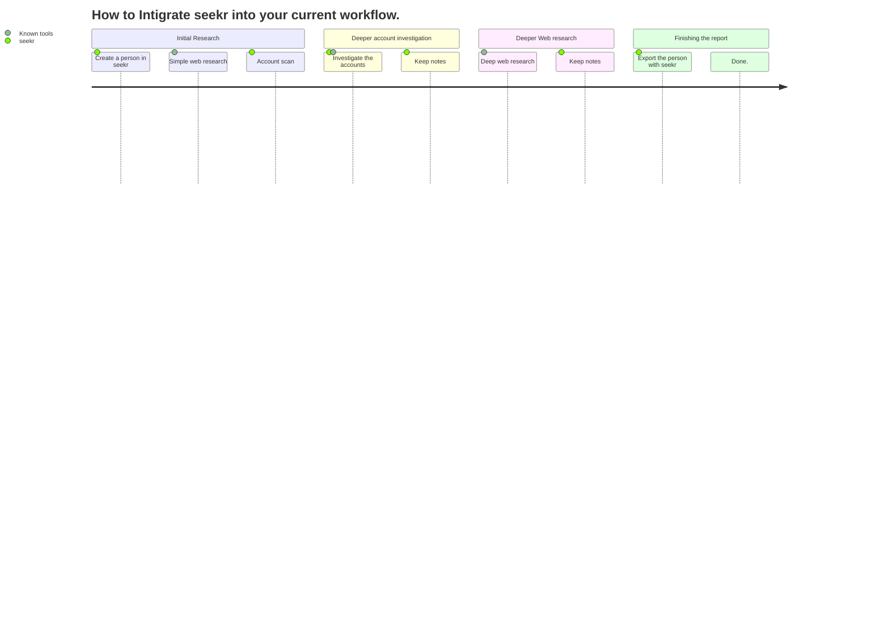

<p align="center">
  <a href="https://github.com/seekr-osint/seekr" target="blank"></a>
 </p>
 
 <p align="center">
 A multi-purpose toolkit for gathering and managing OSINT-Data with a neat web-interface.
</p>
<p align="center">


</p>


## Introduction
eekrS is a multi-purpose toolkit for gathering and managing OSINT-data with a sleek web interface. The backend is written in Go and offers a wide range of features for data collection, organization, and analysis. Whether you're a researcher, investigator, or just someone looking to gather information, SEEKR makes it easy to find and manage the data you need. Give it a try and see how it can streamline your OSINT workflow!

Check the wiki for setup guide, etc.
## Intigrating seekr into your current workflow


## Getting Started
To install seekr on linux simply run:
```sh
git clone https://github.com/seekr-osint/seekr
cd seekr
go run main.go
```
Now open [the web interface](http://localhost:5050) in your browser of choice.

## Legal Disclaimer
This tool is intended for legitimate and lawful use only. It is provided for educational and research purposes, and should not be used for any illegal or malicious activities, including doxxing. Doxxing is the practice of researching and broadcasting private or identifying information about an individual, without their consent and can be illegal. The creators and contributors of this tool will not be held responsible for any misuse or damage caused by this tool. By using this tool, you agree to use it only for lawful purposes and to comply with all applicable laws and regulations. It is the responsibility of the user to ensure compliance with all relevant laws and regulations in the jurisdiction in which they operate. Misuse of this tool may result in criminal and/or civil prosecution.
## Thanks to
[](https://github.com/seekr-osint/seekr/stargazers)
