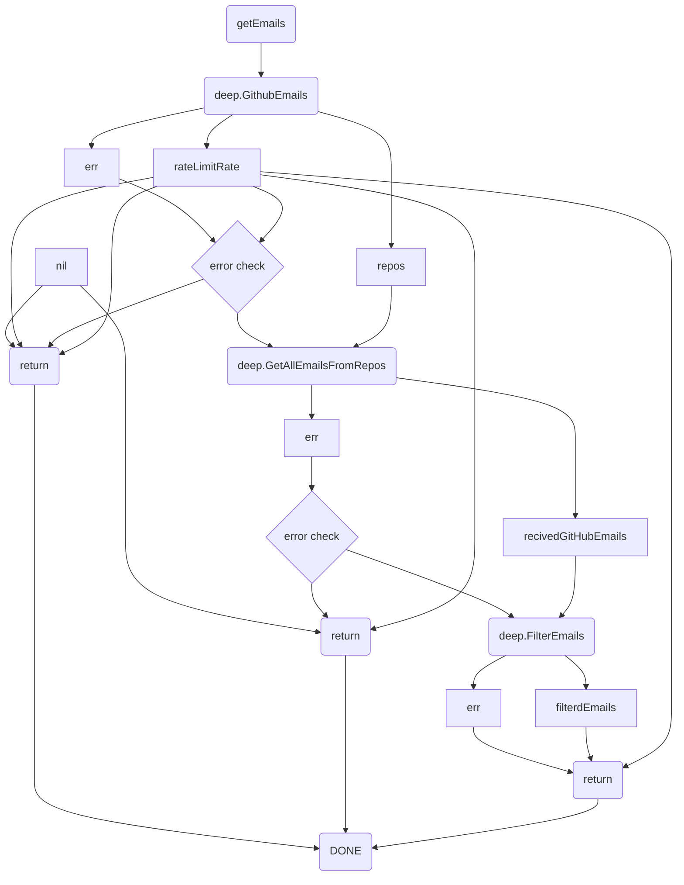

# Flowchart
Useful to get back into the code after a while.
- TODO: Called functions should get a flow too.

```mermaid
flowchart TB
    nil --> return
    nil --> return2
    rateLimitRate --> return
    getEmails("getEmails") -->
    A("deep.GithubEmails") --> repos["repos"]
    A --> rateLimitRate["rateLimitRate"]
    A --> err["err"]
    err --> check{"error check"}
    rateLimitRate --> check
    check --> return("return")
    check --> deep.GetAllEmailsFromRepos
    repos -->  deep.GetAllEmailsFromRepos("deep.GetAllEmailsFromRepos")
    deep.GetAllEmailsFromRepos --> err2["err"]
    deep.GetAllEmailsFromRepos --> recivedGitHubEmails["recivedGitHubEmails"]
    err2 --> check2{"error check"}
    check2 --> return2("return")
    check2 --> deep.FilterEmails
    recivedGitHubEmails --> deep.FilterEmails("deep.FilterEmails")
    deep.FilterEmails --> filterdEmails["filterdEmails"]
    deep.FilterEmails --> err3["err"]
    err3 --> return3
    filterdEmails --> return3("return")
    rateLimitRate --> return
    rateLimitRate --> return2
    rateLimitRate --> return3
    return --> done("DONE")
    return2 --> done
    return3 --> done
```
